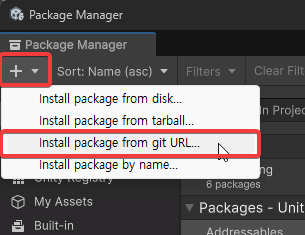
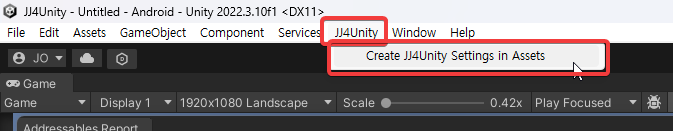
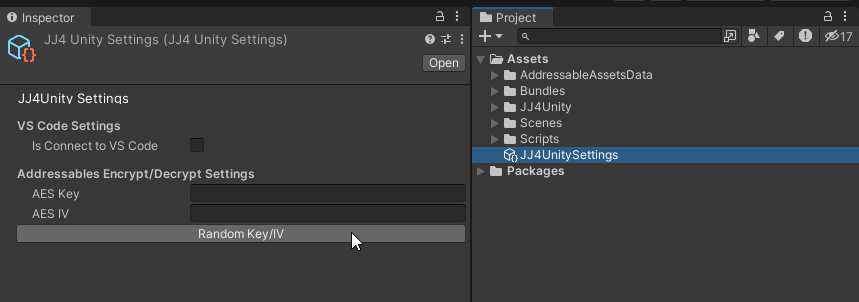
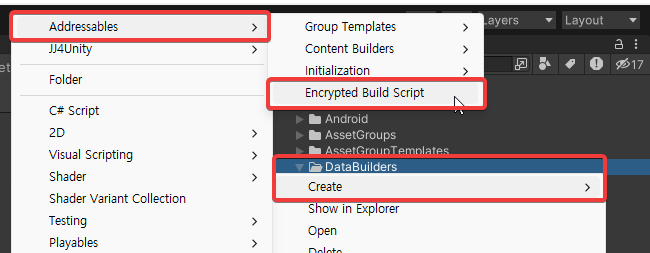
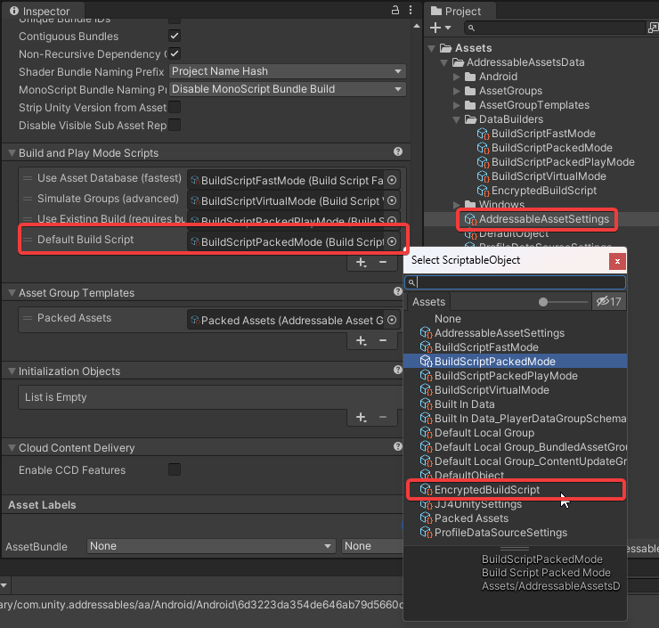
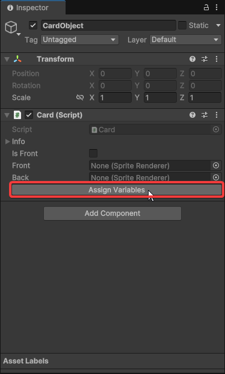

# JJ4Unity

Unity를 쓰면서 유용한 기능을 모은 저장소

## 설치 방법



1. *Package Manager*에서 `+`를 눌러서 `Add package from git URL...`을 선택합니다.
2. 다음 주소를 복사/붙여넣기 합니다.
    > `https://github.com/onsemy/JJ4Unity.git?path=Assets/JJ4Unity`

또는, Github Release에서 다운로드 받아서 적절한 위치에 복사/붙여넣기 합니다.

## 구동 환경

JJ4Unity는 다음 환경에서 정상 동작하도록 개발하고 있습니다.

- Unity 6.x 이상 ([6000.0.23f1](unityhub://6000.0.23f1/1c4764c07fb4) 이상)
    - https://unity.com/releases/editor/archive

### 종속성 패키지

아래의 패키지와 함께 사용하도록 개발되어 있습니다.

- [Addressables 2.2.2](https://docs.unity3d.com/Packages/com.unity.addressables@2.2/manual/index.html) 이상

## 예제 코드

`Assets/Scenes/SampleScene.unity`에서 실행하여 확인 할 수 있습니다. 예제 코드는 `Assets/Test.cs`에서 확인 가능하고, `Test.cs`가 부착된 게임 오브젝트는 `Main Camera` 입니다.

## 주요 기능

### Addressables 암/복호화 추가

기본적인 Addressables는 암호화 및 복호화하지 않고 불러와서 애써 만든 소중한 에셋이 탈취 당할 가능성이 높습니다. 해커를 조금 귀찮게 해줄 암/복호화 기능을 추가했습니다. 프로젝트에서 사용하기 위해 다음과 같은 코드를 Addressables를 사용하기 전에 호출해주세요.

> ```csharp
> Addressables.ResourceManager.ResourceProviders.Add(
>     new EncryptedAssetBundleProvider(
>         key: "1234567890abcdef",
>         iv: "1234567890abcdef"
>     )
> );
>
> Addressables.InitializeAsync(false);
> // ...
> ```

위와 같은 암/복호화를 사용하는 경우, `JJ4UnitySettings`를 생성/설정해야 합니다.




*Random Key/IV* 버튼을 누르면 Key와 IV에 임의의 16바이트 값이 생성됩니다. 이는 위에 적힌 예제 코드에서 key, iv에 각각 넣으면 됩니다.

암호화된 Asset Bundle을 Build하려는 경우, `Assets/AddressableAssetsData/DataBuilders`에 사전에 정의된 `EncryptedBuildScript`를 생성해야 합니다.



또한, *Addressables Asset Settings*의 *Build and Play Mode Scripts*에서 Default Build Script 부분을 방금 생성한 `EncryptedBuildScript`로 설정해야 합니다.



### Debug

UnityEngine.Debug를 대체합니다. Scripting Define에 `__DEBUG__`가 선언되어 있는 경우에만 출력됩니다. 로그를 호출하는 경우 다음과 같이 출력됩니다.

> `[파일명::클래스명:L줄번호:T프레임카운트] 로그내용`

### AssignPath

런타임 또는 에디터에서 `public` 또는 `[SerializeField]`로 선언된 멤버 변수를 자동으로 할당해주는 기능입니다.

```csharp
// 런타임에서 사용할 경우
using JJ4Unity.Runtime.Attribute;
using JJ4Unity.Runtime.Extension;

public class SomeClass1 : MonoBehaviour
{
    [SerializeField, AssignPath] private SpriteRenderer _front;

    private void Awake()
    {
        // 아래 함수를 반드시 실행해야 합니다.
        this.AssignPaths();
    }
}
```

```csharp
// 에디터에서 사용할 경우
using JJ4Unity.Runtime.Attribute;

public class SomeClass2 : MonoBehaviour
{
    [SerializeField, AssignPath(true)] private SpriteRenderer _front;
}

// 이후 Unity Editor에서 해당 컴포넌트가 추가된 게임 오브젝트를
// 선택하여 인스펙터에서 [Assign Variables] 버튼을 누릅니다.
```



### Visual Studio Code 연동

Visual Studio Code를 코드 편집기로 사용하는 경우, [JJ4UnityVSC](https://github.com/onsemy/JJ4UnityVSC) 확장 프로그램을 설치한 이후 코드 편집기 내에서 C# 스크립트를 편집 후 저장하는 경우 Unity Editor가 자동으로 갱신되며 컴파일이 시작됩니다. (JetBrains Rider에서 제공하는 기능과 유사하다고 보시면 됩니다.)

해당 기능을 끄고 싶다면, 상단 메뉴바의 `JJ4Unity/Toggle Connect to VSCode`를 선택하여 토글해주세요.

### Singleton/MonoBehaviour Singleton

일반적인 `Singleton<T>`과 MonoBehaviour를 위한 `MonoSingleton<T>`을 쓸 수 있습니다.

### ReadOnly

`public` 또는 `[SerializeField]`로 선언된 멤버 변수를 유니티 에디터의 인스펙터에서 수정할 수 없도록 합니다.

```csharp
using JJ4Unity.Runtime.Attribute;

public class SomeClass3 : MonoBehaviour
{
    [SerializeField, ReadOnly] private int _readOnlyInt = 10;
    [ReadOnly] public string _readOnlyStringValue = "ReadOnlyStringValue";
}
```

## 알려진 문제

### Visual Studio Code 연동 기능이 하나의 Unity Editor에서만 사용 가능

Unity Editor와 Visual Studio Code가 1:1로 하나만 연동됩니다. 추후 다중 연결을 지원할 예정입니다.

### 암/복호화 기능 사용 시, `Addressables.InitializeAsync()` 예외 문제

암/복호화 기능 사용 시, `Addressables.InitializeAsync()`를 호출할 경우 다음과 같은 예외가 발생할 수 있습니다.

> `Exception: Attempting to use an invalid operation handle`

그럴 경우, `Addressables.InitializeAsync(false);`를 호출할 것을 권고드립니다.

```csharp
private IEnumerator InitializeAddressables()
{
    // var handle = Addressables.InitializeAsync(); // maybe occurred exception.
    var handle = Addressables.InitializeAsync(false);
    yield return handle;

    if (handle.Status != AsyncOperationStatus.Succeeded)
    {
        Debug.LogError($"InitializeAddressables failed: {handle.Status}");
        yield break;
    }
    
    Debug.Log($"Initialize Addressables");
    Addressables.Release(handle);
}
```
